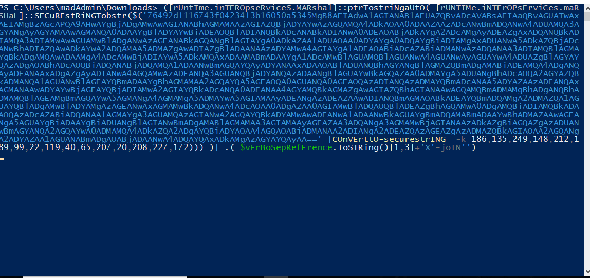
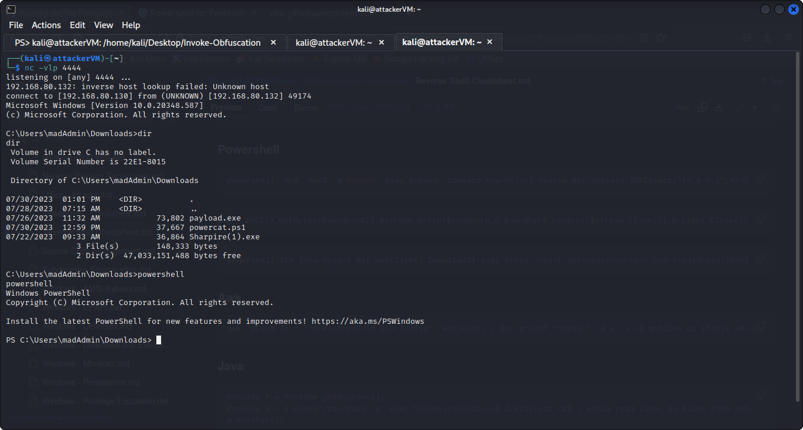

# Defense Evasion (Method #2)

Clone **Invoke\_Obfuscation** from github&#x20;

[https://github.com/danielbohannon/Invoke-Obfuscation](https://github.com/danielbohannon/Invoke-Obfuscation)

Now open powershell in terminal by typing **pwsh** and move in the directory and type **Import-Module Invoke-Obfuscation.psd1** and then type Invoke-Obfuscation&#x20;

<figure><figcaption></figcaption></figure>

Now Select and payload from the Powershell payloads from github and save it with the extension **.ps1**

{% embed url="https://github.com/swisskyrepo/PayloadsAllTheThings/blob/master/Methodology%20and%20Resources/Reverse%20Shell%20Cheatsheet.md#powershell" %}

<figure><figcaption></figcaption></figure>

Change the Ip to your attacker IP and port number.

<figure><figcaption></figcaption></figure>

Now to set scriptpath to the payload.ps1 file.

<figure><figcaption></figcaption></figure>

then type ENCODING and select one of the options and hit enter and payload will be generated and then send it to the victim.

<figure><figcaption></figcaption></figure>

In this case i am directly copy pasting the payload to the powershell in the victim machine.

Before hitting enter open a new terminal tab and run the netcat listener.&#x20;

```bash
nc -vlp 4444
```

<figure><figcaption></figcaption></figure>

And after successful execution of the pwsh script you will get the reverse connection to the attacker machine.

<figure><figcaption></figcaption></figure>
