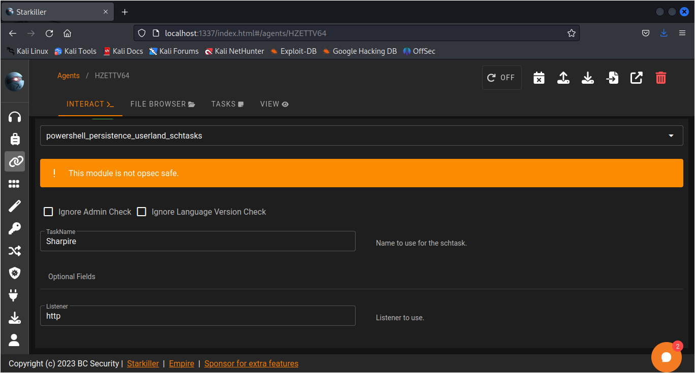
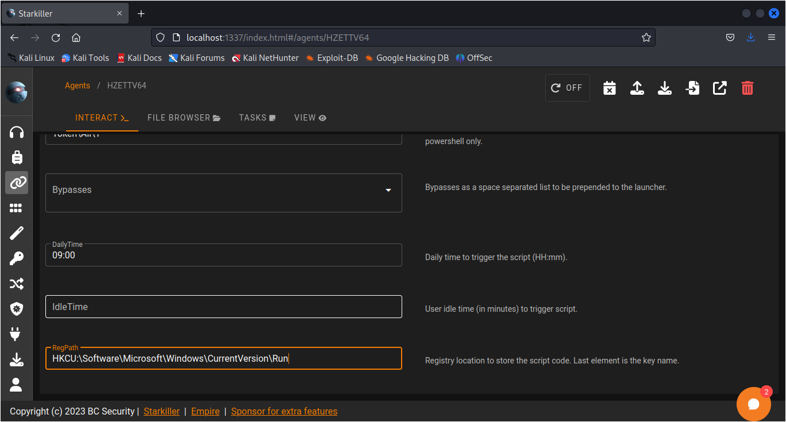
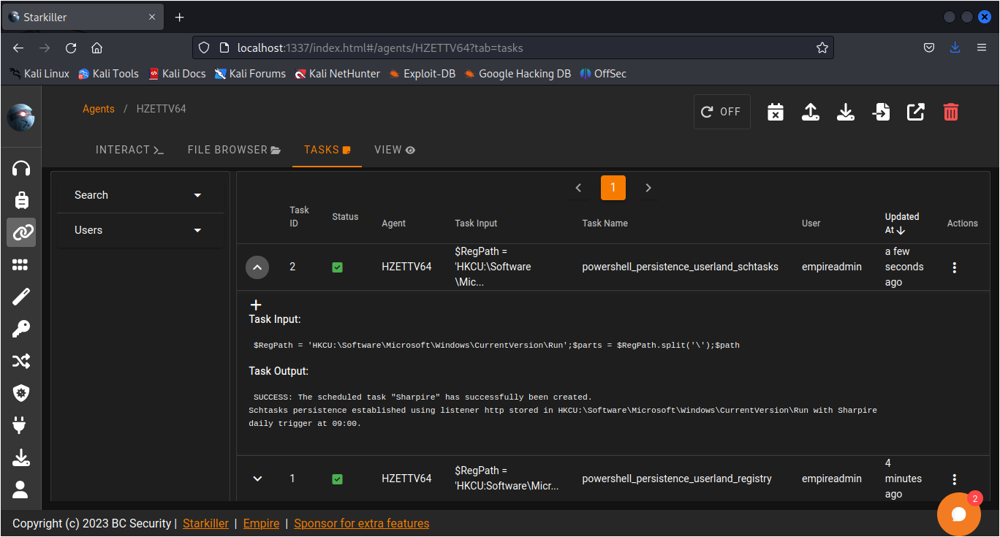
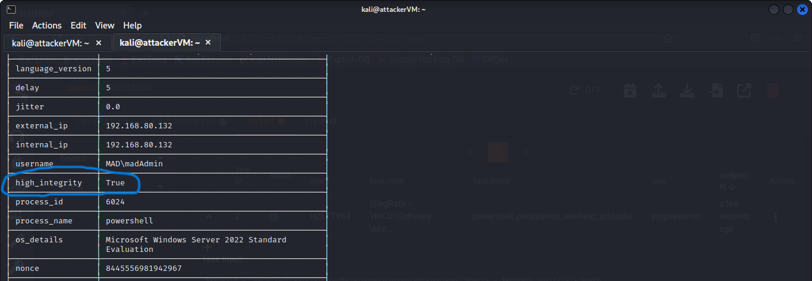
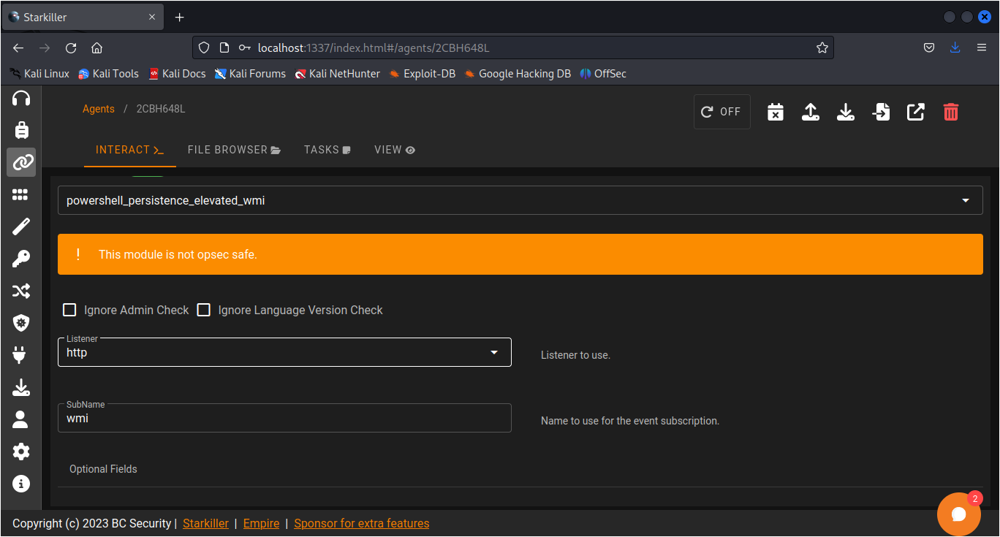
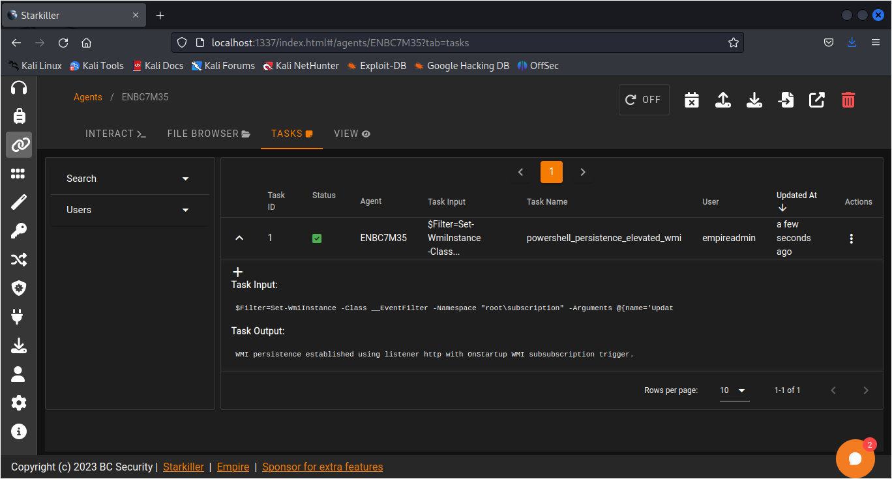
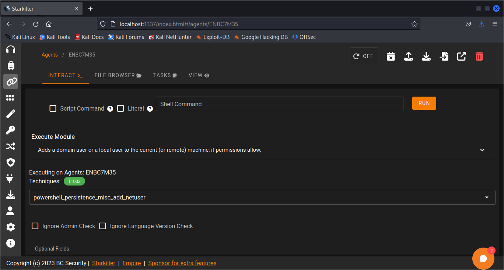
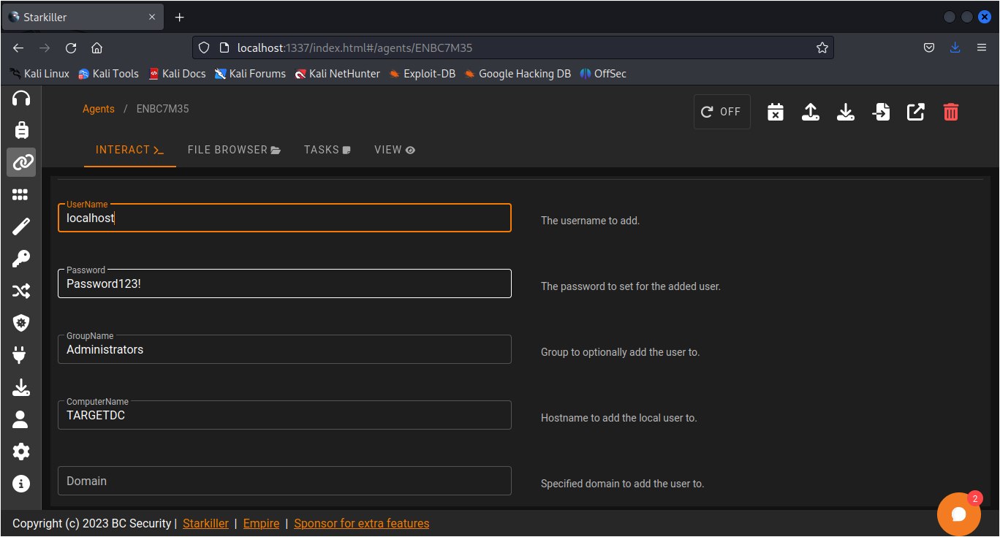

# Persistence

In the previous chapter we have setup the reverse connection in the powershell-empire and in this chapter we will be using it for persistence so that after the victim restarted the machine we will again get the reverse connection.

First type agents to see the total agents running (green are the active one's and red are the dead ones).

<figure><figcaption></figcaption></figure>

To interact with an agent type interact and hit tab to auto-complete the id, and in that type **info** to check the all details about the agent.

HIgh\_intergrity shows the previlege of the agent if it is false then it the agent is normal user and if it is true then it is High privilege user. In our case the user has normal privilege right now which we will be elevate in further steps.

<figure><figcaption></figcaption></figure>

Now we will run a module privesc\_powerup\_allchecks because it runs all the checks included in the module to check that we can elevate our agent from that agent or not.

<figure><figcaption></figcaption></figure>

You can check the output from the starkiller also go to agents > select the agent and in the tasks tab click on the task of which you want to see the output.

<figure><figcaption></figcaption></figure>

After that we will use the module privesc\_bypassuac to get the elevated agent

<figure><figcaption></figcaption></figure>

then set the listener to http and type execute. And in some time you will get the elevated agent showing in your starkiller and you can also see in terminal by typing agents.The agent which has the user logo is the elevated agent.

<figure><figcaption></figcaption></figure>

Now from the normal agent we will run a module userland\_schtasks because "persistence/userland/schtasks" module is used to create a persistent backdoor on a compromised Windows system by adding a scheduled task that executes a PowerShell command. This module is used to maintain control of a system even after it has been restarted or the user has logged off.

<figure><figcaption>
Change the listener to http
</figcaption></figure>

<figure><figcaption>
Change RegPath to "<strong>HKCU:\Software\Microsoft\Windows\CurrentVersion\Run"</strong>
</figcaption></figure>

<figure><figcaption>
Output 
</figcaption></figure>



After the schtask is successfully created you can also check that the new agent has high\_privilege by interacting it and type info to see it.

<figure><figcaption>
High_Integrity User.
</figcaption></figure>

Now we will create a persistence for the high\_privilege user also. For that we will use the module elevated\_wmi because it is used to create a persistent backdoor on a compromised Windows system by creating a Windows Management Instrumentation (WMI) event subscription that executes a PowerShell command as a privileged user. This module is used to maintain control of a system even after it has been restarted or the user has logged off.

<figure><figcaption></figcaption></figure>

In the Interact tab in the starkiller select the module and set listener to http and change Subname to as you want and click and submit.

<figure><figcaption></figcaption></figure>

As you can see in the output the wmi persistence is successfully established.

Or You can also use other module which is "miss\_add\_netuser" module is used to create a persistent backdoor on a compromised Windows system by adding a new user account with administrative privileges. This module is used to maintain control of a system even after it has been restarted or the user has logged off.

<figure><figcaption></figcaption></figure>

Change the **Username** to localhost or any other, and **ComputerName** to the hostname of your agent and click submit.

<figure><figcaption></figcaption></figure>

After the module is successfully executed we will restart the victim machine to check that the persistence is working or not.

<figure><figcaption></figcaption></figure>

Here you can see after restarting the victim machine the new agent has called back to the starkiller and there are two high integrity agent because we executed two modules in the high integrity user.

That's all this chapter now we will move forward to the next chapter.
