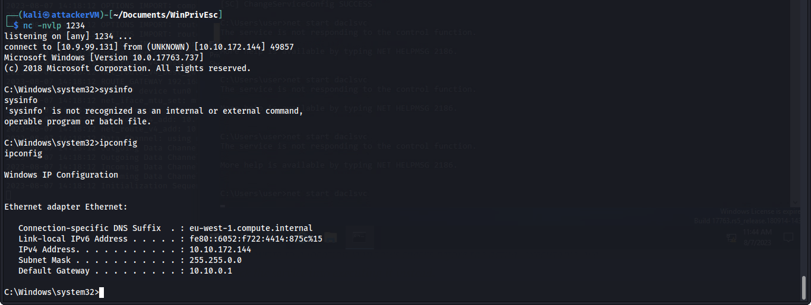

# Persistence

In the previous chapter we have setup the reverse connection in the powershell-empire and in this chapter we will be using it for persistence so that after the victim restarted the machine we will again get the reverse connection.

First type agents to see the total agents running (green are the active one's and red are the dead ones).

<figure><figcaption></figcaption></figure>

To interact with an agent type interact and hit tab to auto-complete the id, and in that type **info** to check the all details about the agent.

HIgh\_intergrity shows the previlege of the agent if it is false then it the agent is normal user and if it is true then it is High privilege user. In our case the user has normal privilege right now which we will be elevate in further steps.

<figure><figcaption></figcaption></figure>

Now we will run a module privesc\_powerup\_allchecks because it runs all the checks included in the module to check that we can elevate our agent from that agent or not.

<figure><figcaption></figcaption></figure>

You can check the output from the starkiller also go to agents > select the agent and in the tasks tab click on the task of which you want to see the output.

<figure><figcaption></figcaption></figure>

After that we will use the module privesc\_bypassuac to get the elevated agent

<figure><figcaption></figcaption></figure>

then set the listener to http and type execute. And in some time you will get the elevated agent showing in your starkiller and you can also see in terminal by typing agents.

<figure><figcaption></figcaption></figure>
